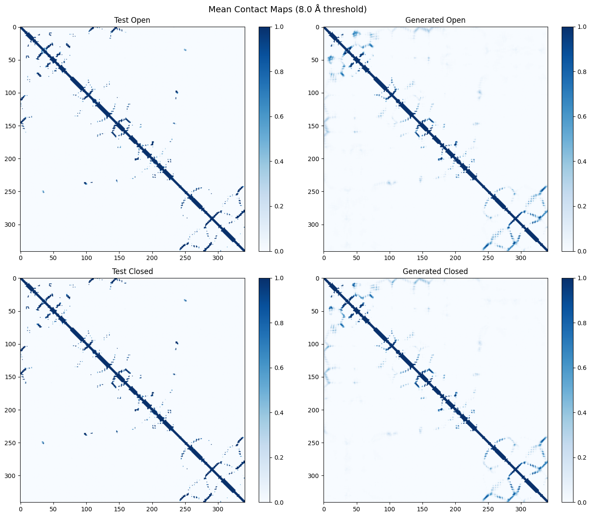
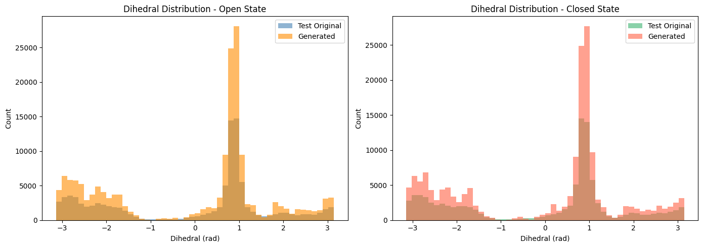
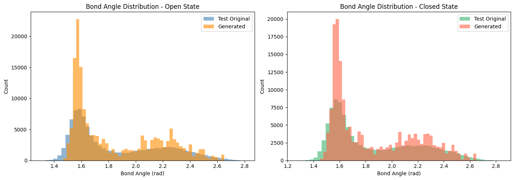
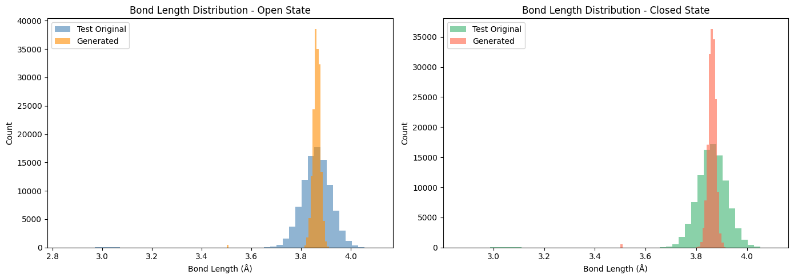
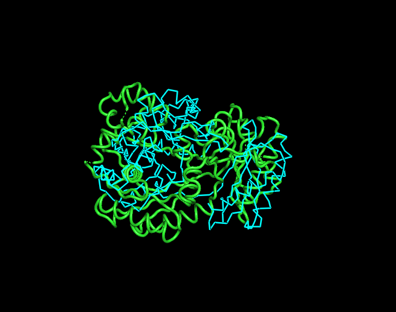

# Protein Conformation Generation using Geometry-Aware Variational Autoencoders

A geometry-aware Variational Autoencoder (VAE) for protein conformational ensemble generation using internal coordinates, NeRF reconstruction, and structural regularization losses.

## Features

- Variational Autoencoder for protein conformations
- Internal-coordinate representation
- NeRF-based Cartesian reconstruction
- Distance-map and contact-map losses
- Prior sampling for structure generation
- RMSD and structural evaluation
- Contact-map analysis
- Latent-space interpolation

## Pipeline Overview

1. Protein structures converted to internal coordinates
2. Geometry-aware Variational Autoencoder trained on conformational ensembles
3. Latent representations sampled from prior distribution
4. Internal coordinates reconstructed into Cartesian coordinates using NeRF
5. Generated structures evaluated using:
   - RMSD
   - Contact maps
   - Bond geometry distributions
   - Torsion-angle statistics

## Model Architecture

- Encoder: Multi-layer Variational Encoder
- Latent Space: Gaussian latent manifold
- Decoder: Geometry-aware decoder for internal-coordinate reconstruction
- Reconstruction: NeRF-based Cartesian reconstruction
- Regularization:
  - KL divergence
  - Distance-map loss
  - Radius-of-gyration loss
  - Contact-map constraints

## Results

### Prior Sampling RMSD

| State | RMSD |
|---|---|
| Open | 2.33 Å |
| Closed | 3.33 Å |

## Contact Map Comparison

---

## Geometry Distribution Analysis

### Dihedral Distributions

### Bond Angle Distributions

### Bond Length Distributions

---

## PyMOL Structural Alignment

## Tech Stack

- Python
- PyTorch
- NumPy
- Matplotlib
- PyMOL

## Future Improvements

- Residual CNN decoder
- Equivariant architectures
- Diffusion-based conformational generation